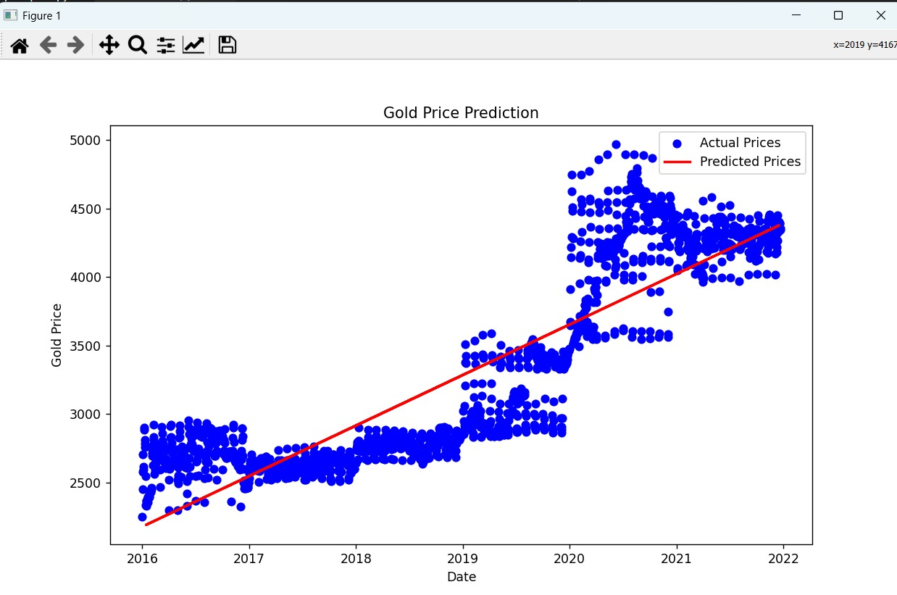

# Gold Price Prediction

This project predicts gold prices based on historical data using a simple Linear Regression model implemented in Python with scikit-learn.

## Dataset

The dataset contains two columns:
- `date`: Date of the record (YYYY-MM-DD)
- `price`: Gold price for 1 gram on that date

## Model Evaluation

The Linear Regression model performed as follows on the test dataset:

- **Mean Squared Error (MSE):** 104,841.01  
- **R² Score:** 0.7935  
- **Model Accuracy:** 79.0%

- **Predicted Gold Price for July 19, 2024:** ₹5329.93

## Example Output

Here is a sample plot showing the actual vs predicted gold prices:

